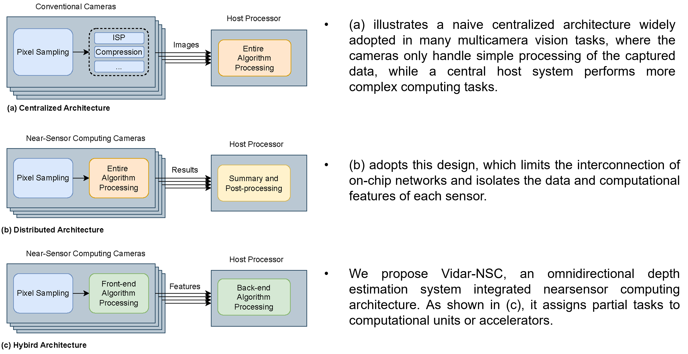
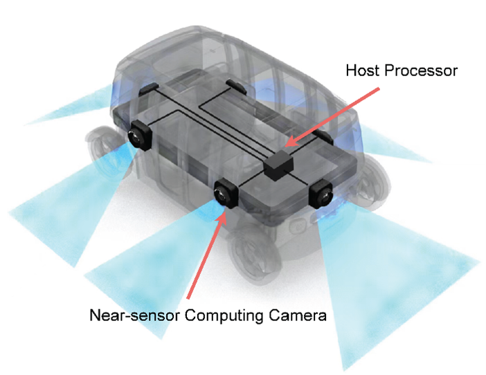
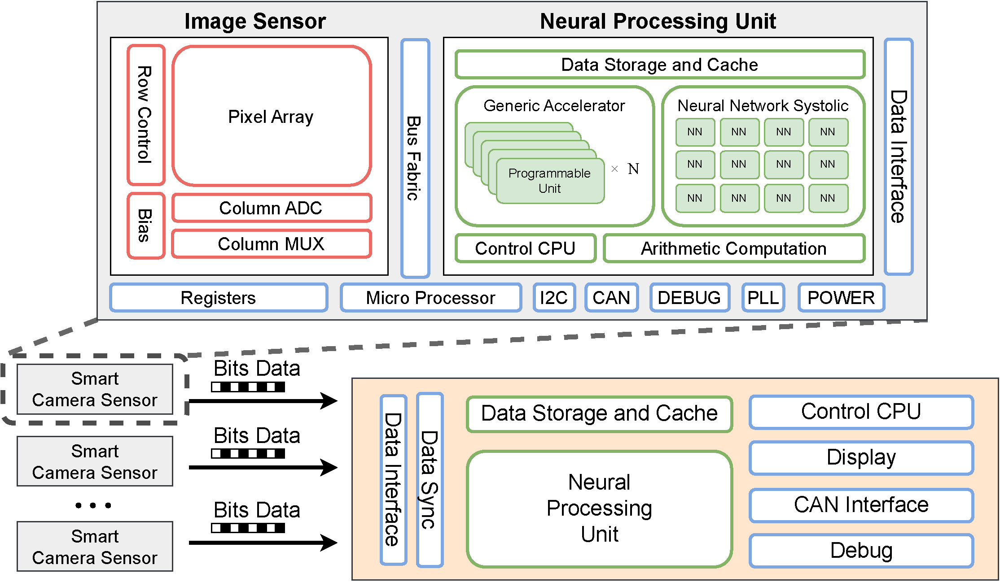

---
# Leave the homepage title empty to use the site title
title:
date: 2022-10-24
type: landing

sections:
  - block: hero
    content:
      title: |
        Vidar-NSC
      image:
        filename: inte.png
      text: |
         
        
        An Omnidirectional Depth Estimation System based on Near-Sensor Computing Architecture for Autonomous Driving
  
  #- block: collection
  #  content:
  #    title: Latest News
  #    subtitle:
  #    text:
  #    count: 5
  #    filters:
  #      author: ''
  #      category: ''
  #      exclude_featured: false
  #      publication_type: ''
  #      tag: ''
  #    offset: 0
  #    order: desc
  #    page_type: post
  #  design:
  #    view: card
  #    columns: '1'
  
  #- block: markdown
  #  content:
  #    title: Abstract
  #    subtitle: ''
  #    text: Accurate 3D perception is essential for autonomous driving. Traditional methods often struggle with geometric ambiguity and slow convergence due to a lack of geometric prior. To address this challenge, we use omnidirectional depth estimation, which is generated by our lab's XXXNET, to introduce geometric prior. Based on the depth information, We propose a cylindrical voxel-based Sketch-Coloring framework. Additionally, our approach introduces a cylindrical voxel representation based on polar coordinate, better aligning with the radial nature of panoramic camera views. This representation adjusts voxel density according to distance, boosting the performance of close proximity. We also build a virtual scene dataset with six fisheye cameras, addressing the lack of fisheye camera dataset in autonomous driving tasks. Experimental results demonstrate that our Sketch-Coloring network significantly enhances 3D perception performance, especially in nearby regions, which makes our method a promising solution for autonomous driving perception.
  - block: markdown
    content:
      title: Problem Statement
      subtitle: 'What have we done compared to the traditional architecture?'
      text:  
  

  - block: markdown
    content:
      title: Hardware Deployment Framework
      subtitle: ''
      text:  
  We utilize an autonomous vehicle equipped with six fisheye cameras on Jetson AGX Orin 64G as the simulation platform, which offers up to 275 TOPS for deep learning acceleration. We divide the entire network according to the task allocation of the system. Correspondingly, we allocate memory and computing resources for each computing task and isolate them from each other. To match the capability of a near-sensor NPU, we restrict the resources for TF , ensuring it operates under 5 TOPS. We achieve depth estimation at 15 frames per second under the input resolution of 1920 × 1080 and the depthmap resoluiton of 720×180 
  
  The hardware design of the system is demonstrated in Fig above, which includes multiple smart camera sensors equipped with computing accelerators and a host side processor. All the data transmitted from sensors are synchronized and consolidated to the host processor with a local NPU to complete the rest of the system tasks. The Vidar-NSC has significantly decreased in duration compared to the original one. In addition, its time consumption increases more slowly as the number of cameras increases, indicating that it has the potential for applications that require more cameras.

  - block: markdown
    content:
      title: Experimental Result
      subtitle: 'Qualitative Comparison with Classical Methods'
      text: 
    We achieve better performance compared with other methods, especially in terms of detail.

  #add some unique images
    #design:
    #  columns: '1'
    #  background:
    #    image: 
    #      filename: coders.jpg
    #      filters:
    #        brightness: 1
    #      parallax: false
    #      position: center
    #      size: cover
    #      text_color_light: true
      spacing:
        padding: ['20px', '0', '20px', '0']
      css_class: fullscreen

  #- block: collection
  #  content:
  #    title: Latest Preprints
  #    text: ""
  #    count: 5
  #    filters:
  #      folders:
  #        - publication
  #      publication_type: 'article'
  #  design:
  #    view: citation
  #    columns: '1'

  - block: markdown
    content:
      title:
      subtitle:
      text: |
        {}
    design:
      columns: '1'
---
